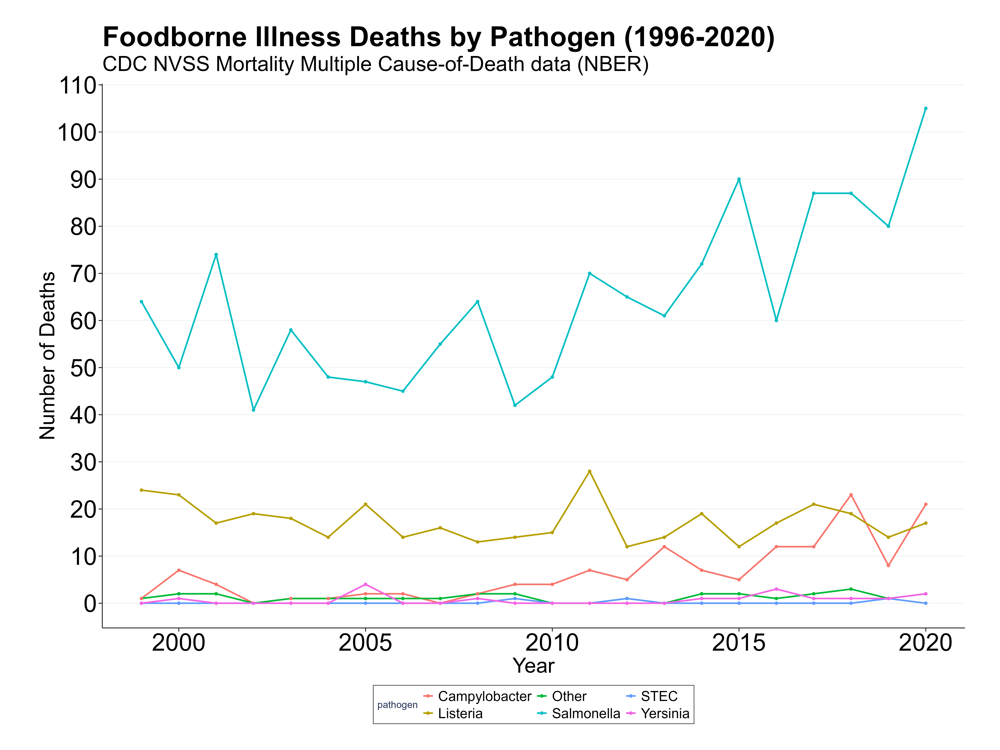
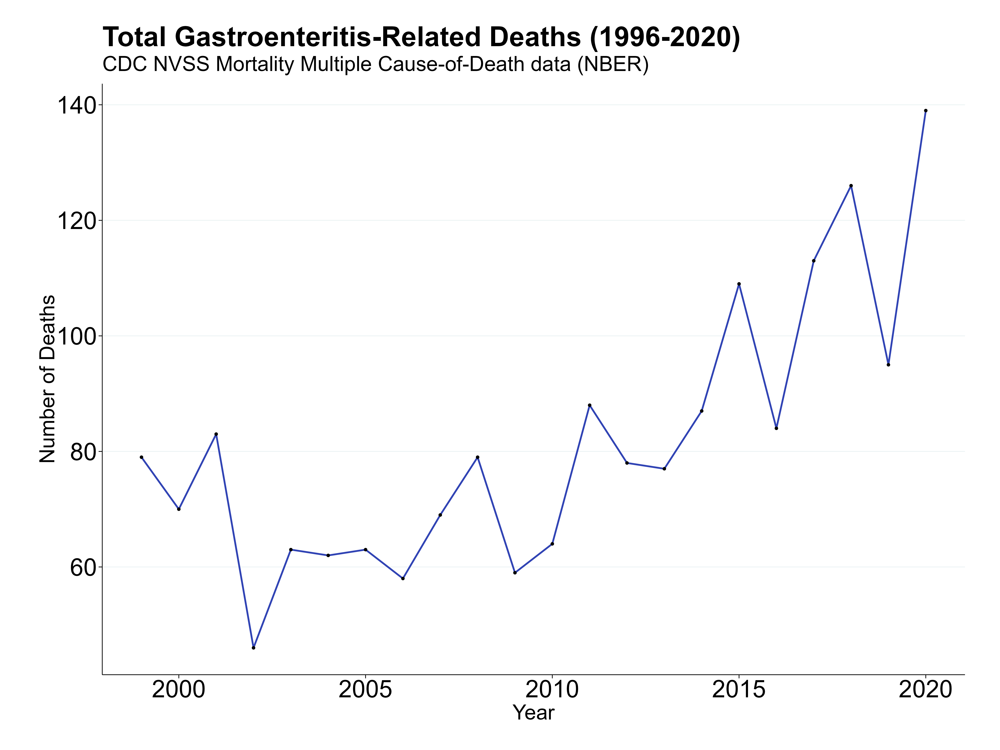

## Population
 63,887,582 total rows, from 1996 - 2020

 ### ICD-10 Codes for Foodborne Illness
 | Pathogen                          | ICD-10 Code | Description                                                                 |
|----------------------------------|-------------|-----------------------------------------------------------------------------|
| Other bacterial intoxications    | A05         | Other bacterial foodborne intoxications, not elsewhere classified           |
|                                  | A05.9       | Bacterial foodborne intoxication, unspecified                               |
| Campylobacter                    | A04.5       | Campylobacter enteritis                                                     |
| Cryptosporidium                  | A07.2       | Cryptosporidiosis                                                           |
| Listeria                         | A32         | Listeriosis                                                                 |
|                                  | A32.7       | Listerial sepsis                                                            |
| Salmonella                       | A02         | Other salmonella infections                                                 |
|                                  | A02.0       | Salmonella enteritis                                                        |
|                                  | A02.1       | Salmonella sepsis                                                           |
|                                  | A02.9       | Salmonella infection, unspecified                                           |
| STEC+ (E. coli)                  | A04.3       | Enterohaemorrhagic Escherichia coli infection                               |
| Vibrio                           | A05.3       | Foodborne Vibrio parahaemolyticus intoxication                              |
| Yersinia                         | A04.6       | Enteritis due to Yersinia enterocolitica                                    |

### ICD-10 Codes for Gastroenteritis
| Category                         | ICD-10 Code | Description                                                                 |
|----------------------------------|-------------|-----------------------------------------------------------------------------|
| Cholera                          | A00.9       | Cholera, unspecified                                                        |
| Typhoid & Paratyphoid           | A01.0       | Typhoid fever                                                               |
|                                  | A01.1       | Paratyphoid fever A                                                         |
|                                  | A01.2       | Paratyphoid fever B                                                         |
|                                  | A01.3       | Paratyphoid fever C                                                         |
|                                  | A01.4       | Paratyphoid fever, unspecified                                              |
| Salmonella                       | A02.0       | Salmonella enteritis                                                        |
|                                  | A02.1       | Salmonella septicaemia                                                      |
|                                  | A02.2       | Localized salmonella infections                                             |
|                                  | A02.8       | Other specified salmonella infections                                       |
|                                  | A02.9       | Salmonella infection, unspecified                                           |
| Shigella                         | A03.0       | Shigellosis due to Shigella dysenteriae                                     |
|                                  | A03.1       | Shigellosis due to Shigella flexneri                                        |
|                                  | A03.2       | Shigellosis due to Shigella boydii                                          |
|                                  | A03.3       | Shigellosis due to Shigella sonnei                                          |
|                                  | A03.8       | Other shigellosis                                                           |
|                                  | A03.9       | Shigellosis, unspecified                                                    |
| E. coli                          | A04.0       | Enteropathogenic E. coli infection                                          |
|                                  | A04.1       | Enterotoxigenic E. coli infection                                           |
|                                  | A04.2       | Enteroinvasive E. coli infection                                            |
|                                  | A04.3       | Enterohaemorrhagic E. coli infection                                        |
|                                  | A04.4       | Other intestinal E. coli infections                                         |
| Campylobacter                    | A04.5       | Campylobacter enteritis                                                     |
| Yersinia                         | A04.6       | Enteritis due to Yersinia enterocolitica                                    |
| Other bacterial intestinal       | A04.8       | Other specified bacterial intestinal infections                             |
|                                  | A04.9       | Bacterial intestinal infection, unspecified                                 |
| Foodborne intoxications          | A05.0       | Foodborne staphylococcal intoxication                                       |
|                                  | A05.2       | Foodborne Clostridium perfringens intoxication                              |
|                                  | A05.3       | Foodborne Vibrio parahaemolyticus intoxication                              |
|                                  | A05.4       | Foodborne Bacillus cereus intoxication                                      |
|                                  | A05.8       | Other specified bacterial foodborne intoxications                           |
|                                  | A05.9       | Bacterial foodborne intoxication, unspecified                               |
| Amoebiasis                       | A06.0       | Acute amoebic dysentery                                                     |
|                                  | A06.1       | Chronic intestinal amoebiasis                                               |
|                                  | A06.2       | Amoebic nondysenteric colitis                                               |
|                                  | A06.3       | Amoeboma of intestine                                                       |
|                                  | A06.4       | Amoebic liver abscess                                                       |
|                                  | A06.5       | Amoebic lung abscess                                                        |
|                                  | A06.6       | Amoebic brain abscess                                                       |
|                                  | A06.7       | Cutaneous amoebiasis                                                        |
|                                  | A06.8       | Other amoebic infections                                                    |
|                                  | A06.9       | Amoebiasis, unspecified                                                     |
| Protozoal intestinal diseases    | A07.0       | Balantidiasis                                                               |
|                                  | A07.1       | Giardiasis                                                                  |
|                                  | A07.2       | Cryptosporidiosis                                                           |
|                                  | A07.3       | Isosporiasis                                                                |
|                                  | A07.8       | Other specified protozoal intestinal diseases                               |
|                                  | A07.9       | Protozoal intestinal disease, unspecified                                   |
| Viral intestinal infections      | A08.0       | Rotaviral enteritis                                                         |
|                                  | A08.1       | Acute gastroenteropathy due to Norwalk agent (norovirus)                    |
|                                  | A08.2       | Adenoviral enteritis                                                        |
|                                  | A08.3       | Other viral enteritis                                                       |
|                                  | A08.4       | Viral intestinal infection, unspecified                                     |
|                                  | A08.5       | Other specified intestinal infections                                       |
| Gastroenteritis (unspecified)    | A09         | Diarrhoea and gastroenteritis of presumed infectious origin                 |
| Noninfectious gastroenteritis    | K52.9       | Noninfectious gastroenteritis and colitis, unspecified                      |

